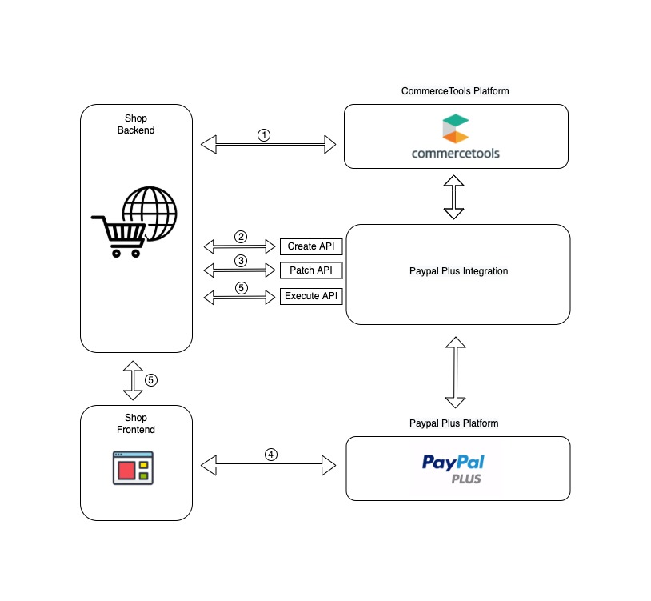

# commercetools _Paypal Plus_ Integration Service

[](https://github.com/commercetools/commercetools-paypal-plus-integration/actions/workflows/ci.yml)
[](https://github.com/commercetools/commercetools-paypal-plus-integration/actions/workflows/cd.yml)
<!-- START doctoc generated TOC please keep comment here to allow auto update -->
<!-- DON'T EDIT THIS SECTION, INSTEAD RE-RUN doctoc TO UPDATE -->
- [Definition](#definition)
- [Architecture](#architecture)
- [Front-end integration guide](#front-end-integration-guide)
- [Local debug](#local-debug)
- [Tests](#tests)
  - [Integration tests](#integration-tests)
- [How to use](#how-to-use)
- [HTTP Responses](#http-responses)
- [Possible edge cases](#possible-edge-cases)
- [How to encrypt/decrypt files](#how-to-encryptdecrypt-files)
- [Build and deploy](#build-and-deploy)
<!-- END doctoc generated TOC please keep comment here to allow auto update -->

## Definition
In this process, there are 3 parties involved:
* **The frontend** -  the browser part of the shop. This is what the user interacts with.
* **The backend** - the shop server.
* **Paypal-integration** - hosted service (this repository) which exposes public endpoints 


## Architectural Diagram


1. Shop backend creates a payment in CT platform and obtains payment ID.
2. Shop backend sends POST request with the obtained payment ID to following Create API of paypal-integration.
    ```
    http://paypal-plus-integration-server.com/${tenantName}/commercetools/create/payments/${ctpPaymentId} 
    ```
    For details, please see [the section 1.1 of How to use](#how-to-use)

3. Shop backend updates user's details by posting the payment object to following Patch API of paypal-integration.
    ```
    http://paypal-plus-integration-server.com/${tenantName}/commercetools/patch/payments/${ctpPaymentId}
    ```
    For details, please see [the section 1.1 of How to use](#how-to-use)
    
4. Execute the payment in front-end, and Paypal-plus returns a URL to front-end and redirect the user to payment authorization page.
 
## Front-end integration guide

See [commercetools _Paypal Plus_ Service Integration Guide](/docs/IntegrationGuide.md) documentation.

## Local debug

```bash
./gradlew bootRun
```

Local _Run/Debug_ setting may be configured in [`/src/main/resources/config/application.yml`](/src/main/resources/config/application.yml) 
file. If the file exists - it overrides default [`/src/main/resources/application.yml`](/src/main/resources/application.yml).


## Tests

### Integration tests

Local integration test setting may be configured in [`/src/test/resources/config/application.yml`](/src/test/resources/config/application.yml) 
file. If the file exists - it overrides main context config and config from  [`/src/test/resources/application.yml`](/src/test/resources/application.yml).
You must include 2 different CT client credentials and paypal_plus client credentials in order to make the integration tests pass successfully.

**Note: keep this settings different from `/src/main/resources/config/application.yml`, 
which is used for local run/debug, because the integration tests will remove all data form the CTP project**


## How to use
1. Show available PayPal payment methods
    1. Backend creates CTP payment and assigns it to the cart. 
        - Required fields for the CTP cart:
            - There must be at least 1 line or custom line item defined
            - Cart total amount should be > 0
            - Shipping address should be set
        - Required fields for the CTP payment:
            - `amountPlanned`
            - `cancelUrl` (custom field)
            - `successUrl` (custom field)
            - `reference` (custom field, up to 116 characters)
            - `languageCode` (custom field)
            - `paymentMethodInfo` needs to be set like this:
            
            ```json
            "paymentMethodInfo": {
              "paymentInterface": "PAYPAL_PLUS",
              "method": "paypal"
            }
            ```
            
        - Optional fields for the CTP payment:
            - `experienceProfileId` (custom field): if the payment should be supplied with certain 
            [Paypal Plus Experience Profile Id](https://developer.paypal.com/docs/api/payment-experience/).
            
              **Note**: looks like there is no certain clarity in PayPal Plus documentation/support 
              how the web experience profiles should be used, and potentially they will be deprecated in the future,
              so we recommend not to use them unless you are completely sure what you achieve using them.
              If you need prevent address change by customers (buyers) - use `shippingPreference` below. 
               
            - `shippingPreference` (custom field): value of `Payment#application_context#shipping_preference` enum.
            This value is used to allow/block shipping address change by the customer (buyer). Reed more at 
            [Application Context Documentation](https://developer.paypal.com/docs/api/orders/#definition-application_context)
            
              **Note**: So far this feature is not properly documented by Paypal API developers, so the reference above 
              actually refers to [Orders API](https://developer.paypal.com/docs/api/orders/#definition-application_context), 
              instead of [Payments API](https://developer.paypal.com/docs/api/payments/#definition-application_context).
              Respective issues are created: 
                - [Payment/Order#applicationContext property is not available](https://github.com/paypal/PayPal-Java-SDK/issues/330#issuecomment-356008914)
                - [Payment application_context is not documented](https://github.com/paypal/PayPal-REST-API-issues/issues/179)
                
            - `description` (custom field): if specified - [`Payment#transaction#description`](https://developer.paypal.com/docs/api/payments/#definition-transaction)
            field is set to this value. Otherwise the description falls back to the following string: 
            
              `Reference: ${payment.custom.fields.reference}`
               
               **Note**: Maximum allowed length according to PayPal Plus API: `127` 
               (including <code>Reference:&nbsp;</code> prefix in case of fallback, so the `reference` custom field
               must be up to 116 characters long)
            
    1. Backend POSTs CTP payment ID created in the previous step to Paypal-integration. Example: 
        ```
        POST http://paypal-plus-integration-server.com/${tenantName}/commercetools/create/payments/${ctpPaymentId}
        ```
        If request was successful both response body and CTP payment object will have `approvalUrl` defined.
    1. Frontend uses returned `approvalUrl` to render available payment methods as described in the Paypal Plus integration documentation.

2. Add user's addresses to Paypal Plus
    1. Before redirect the user to Paypal, backend POSTs CTP payment ID to Paypal-integration:
        ```
        POST http://paypal-plus-integration-server.com/${tenantName}/commercetools/patch/payments/${ctpPaymentId}
        ```
    1. NOTICE: frontend developers should refer to the newest version of Paypal Plus Integration documentation to know how to make a request
    before redirect in Javascript. As of August 2017, on submit should call `ppp.doContinue()`. Additionally,
    `ppp` object must be created with the following option:
     ```javascript
         var ppp = PAYPAL.apps.PPP({
             onContinue: function () {
                   $.post("/url-to-your-shop-that-will-make-call-to-paypal-integration", function (data) {
                   if (data != false) {
                     ppp.doCheckout();
                   }
               });
             }
         });
     ```

3. Execute payment after user successfully finished PayPal Plus checkout and was redirected back to the shop through `successUrl`.
    PayPal Plus will set 3 request parameters to `successUrl`:
    - `token`
    - `paymentId` - identifies this particular payment. **Required for execute payment.**
    - `PayerID` - identifies the particular payer. **Required for execute payment.**
    
    Example of `successUrl` returned by PayPal Plus: 
    ```
    http://example.com/checkout/payment/success?paymentId=${paymentId}&token=${token}&PayerID=${payerId} 
    ```
    1. It is strongly recommended to compare the payment from Paypal to payment from CTP to see if there were any changes during the payment process.
     Example of how this can happen is described [here](https://github.com/commercetools/commercetools-paypal-plus-integration/issues/62). The possible changes could be:
        1. User's shipping address has changed
        1. Cart total amount has changed
        
        Backend GET Paypal payment by `paypalPaymentId`:
        ```
        GET http://paypal-plus-integration-server.com/${tenantName}/paypalplus/payments/${paypalPaymentId}
        ```
        The Paypal Plus payment object will be returned in `payment` as JSON like this:
        ```json
        {"payment":"{\"id\":\"PAY-xxx\",\"intent\":\"sale\",\"cart\":\"1234abcd\", .... }"}
        ``` 
    
    2. Backend extracts PayPal specific parameters: `paymentId`, `PayerID` and POSTs them in the request body to Paypal-integration for payment execution. Example:
        ```
        POST http://paypal-plus-integration-server.com/${tenantName}/commercetools/execute/payments/
        {"paypalPlusPaymentId": "${paymentId}", "paypalPlusPayerId": "${payerId}"}
        ```
    3. In case of **invoice payment**, the bank details for the invoice will be saved as custom fields in the Payment object. Example:
        ```json
        {
           "custom": {
            "type": {
              "typeId": "type",
              "id": "1455d4e6-41b4-yyyy-xxxx-4f120864e231"
            },
            "fields": {
              "reference": "6KF07542JV235932C",
              "description": "Thank you for your order. Order number: 12345",
              "paymentDueDate": "2017-09-27",
              "amount": {
                "centAmount": 200,
                "currencyCode": "EUR"
              },
              "paidToIBAN": "DE1212121212123456789",
              "paidToAccountBankName": "Deutsche Bank",
              "paidToAccountHolderName": "PayPal Europe",
              "paidToBIC": "DEUTDEDBPAL"
            }
          }
        }
        ``` 
    
## HTTP Responses
All endpoints accept and return data as JSON.

1. Return HTTP codes on `create/payments` endpoint URL:
- **201**: successfully created payment in PayPal and CTP updated with approvalUrl as custom field

1. Return HTTP codes on `execute/payments` endpoint URL:
- **201**: successfully executed payment in PayPal, created transaction in CTP

1. Return HTTP codes on `paypalplus/payments/${paypalPaymentId}` endpoint URL:
- **200**: Paypal payment found and returned as JSON response body

1. Common error codes
- **404**: resource not found by the supplied UUID/ID
- **400**: required request parameters are missing or wrong
- **503**: any exception which implies that request can be safely retried with the same parameters/payload again
- **500**: unexpected/not handled exceptions

Additionally, response can contain additional response body. All fields of the response body are optional. Example:
```json
{
  "approvalUrl": "https://test.de",              # applicable only in case of create payment
  "errorCode": "",                               # only in case of error and represents a unique error code
  "errorMessage": "Parameter 'x' is missing"     # only in case of error
  "payment": {"id":"XXX", "intent":"sale", ...}  # only in case of getting the payment object 
}
```

## Possible edge cases
1. First case:
    1. user inputs an address Berlin, Germany
    1. he clicks on Continue and is redirected to Paypal payment page with this address.
    1. In a different tab, the same user changes his address to Paris, France.
    1. The user confirms the payment in the first tab and is redirected back to shop
    1. Paypal has the address of Berlin, but the shop will deliver the goods to Paris.
    
    **Possible solution:** the backend calls `patch/payments` endpoint every time user changes it.

1. Second case:
    1. user has cart with item1=10€
    1. user is redirected to Paypal payment page
    1. in a different tab, user changes his cart to e.g. item2=20€
    1. user completes the payment in the first tab and is redirected back to shop
    1. paypal approves the payment for 10€, but the real total amount of sold (shipped) items has changed to 20€
    
    **Possible solution:** the backend has to compare total amount of the payment and total amount of payment's cart before calling `execute/payments` endpoint.
     In case of differences, the whole payment process must be restarted.

## How to encrypt/decrypt files

1. Request Professional Services team to add you as an encryptor/decryptor to 
`ps-keyring#commercetools-paypal-plus-integration` key.

1. [Install/update `gcloud` client (SDK)](https://cloud.google.com/sdk/gcloud/)

1. Navigate to [`root`](/) directory.

1. Run the following commands to:
    - Encrypt `build-settings.sh` file (must be ignored by VCS):

        ```bash
        gcloud kms encrypt \
            --project=professionalserviceslabs \
            --location=global  \
            --keyring=ps-keyring \
            --key=commercetools-paypal-plus-integration \
            --plaintext-file=build-settings.sh \
            --ciphertext-file=build-settings.sh.enc
        ```
    
    - Decrypt `build-settings.sh.enc`:
    
      ```bash
      gcloud kms decrypt \
                 --project=professionalserviceslabs \
                 --location=global  \
                 --keyring=ps-keyring \
                 --key=commercetools-paypal-plus-integration \
                 --plaintext-file=build-settings.sh \
                 --ciphertext-file=build-settings.sh.enc
       ```

## Build and deploy

- This module is deployed as docker image to dockerhub.

- The build and deployment of the docker are done using github actions.

- On each push to the remote github repository, the github action [ci](https://github.com/commercetools/commercetools-paypal-plus-integration/actions/workflows/ci.yml) is triggered, which builds the project and
 executes its tests. 
 
- The github action [cd](https://github.com/commercetools/commercetools-paypal-plus-integration/actions/workflows/cd.yml) is used to create the docker-image and deploy it to dockerhub. This action is triggered when a git release tag is
 created.

 There are two ways to create the release-tag:
 - via command line

 ```bash
 git tag -a v1.0.1 -m "Minor text adjustments."
 ```
 
- via [Github UI](https://github.com/commercetools/commercetools-paypal-plus-integration/releases)
